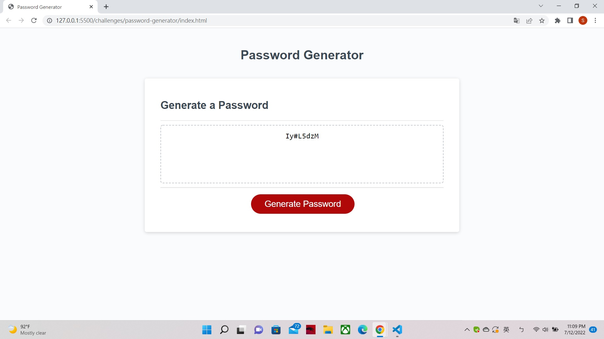

# password-generator
* I use getElementById to grab passwordEl as ID = "password" element in HTML (Line 5 in JS)
* Then I use function to create two strings and then drop in a for loop with math function to generate the random password. (Line 9 in JS)
* Last step is to use a function to trigure the password generate funtion when the Botton is being clicked (Line 24 in JS)

link to deployed application (https://sky19930112.github.io/password-generator/)

